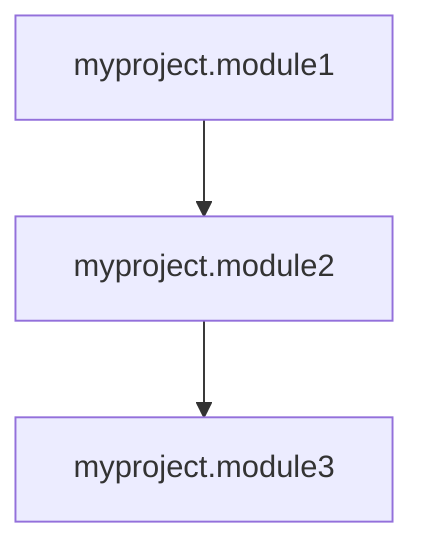

# PyGuard Advanced Integrations Guide

This guide covers the advanced features introduced in PyGuard 0.3.0 that enhance your development workflow.

## Table of Contents

- [CI/CD Integration](#cicd-integration)
- [Performance Profiler](#performance-profiler)
- [Dependency Analyzer](#dependency-analyzer)
- [Custom Rules Engine](#custom-rules-engine)

---

## CI/CD Integration

Automatically generate CI/CD configuration files for various platforms.

### Quick Start

```python
from pyguard import generate_ci_config, install_pre_commit_hook

# Generate GitHub Actions workflow
config = generate_ci_config("github_actions", ".github/workflows/pyguard.yml")
print("Generated GitHub Actions workflow!")

# Install pre-commit hook
install_pre_commit_hook()
print("Installed pre-commit hook!")
```

### Supported Platforms

- **GitHub Actions** — Full SARIF support, security tab integration
- **GitLab CI** — SAST report generation
- **CircleCI** — Artifact storage
- **Azure Pipelines** — Build artifacts
- **Pre-commit hooks** — Fast local scanning

### Example: GitHub Actions

```python
from pyguard.lib.ci_integration import CIIntegrationGenerator

generator = CIIntegrationGenerator()

# List all supported platforms
platforms = generator.list_supported_platforms()
print(f"Supported: {', '.join(platforms)}")

# Generate config for GitHub Actions
config = generator.generate_config("github_actions")

# Save to file
from pathlib import Path
output_file = Path(".github/workflows/pyguard.yml")
output_file.parent.mkdir(parents=True, exist_ok=True)
output_file.write_text(config)
```

Generated workflow includes:
- ✅ Checkout and Python setup
- ✅ PyGuard installation
- ✅ Security scan with SARIF output
- ✅ Upload to GitHub Security tab
- ✅ HTML report artifacts

### Example: Pre-commit Hook

```python
from pyguard.lib.ci_integration import PreCommitHookGenerator

generator = PreCommitHookGenerator()

# Generate hook script
hook_script = generator.generate_hook_script(security_only=True)

# Install in current repo
from pathlib import Path
success = generator.install_hook(Path("."))
print(f"Hook installed: {success}")
```

Hook features:
- ✅ Runs on staged Python files only
- ✅ Fast security-only scan option
- ✅ Blocks commits with issues
- ✅ Easy to install/uninstall

### Generate All Configs at Once

```python
from pyguard.lib.ci_integration import CIIntegrationGenerator
from pathlib import Path

generator = CIIntegrationGenerator()

# Generate all CI configs
output_dir = Path("ci-configs")
generated = generator.generate_all_configs(output_dir)

for platform, path in generated.items():
    print(f"{platform}: {path}")
```

---

## Performance Profiler

Detect performance bottlenecks and suggest optimizations.

### Quick Start

```python
from pyguard import analyze_performance

# Analyze a file
issues = analyze_performance("mycode.py")

for issue in issues:
    print(f"{issue.severity}: {issue.message}")
    print(f"  Line {issue.line_number}")
    print(f"  Suggestion: {issue.suggestion}")
    print(f"  Impact: {issue.estimated_impact}")
```

### Detected Issues

The performance profiler detects:

1. **List concatenation in loops** (O(n²) complexity)
2. **Nested loops without early exit** (O(n²) or worse)
3. **Uncompiled regex patterns** (10-100x slower)
4. **Redundant .keys() calls** (unnecessary overhead)
5. **Inefficient sum() with lists** (high memory usage)
6. **Complex list comprehensions** (readability/optimization issues)

### Example: Detailed Analysis

```python
from pyguard.lib.performance_profiler import PerformanceProfiler

profiler = PerformanceProfiler()

code = """
import re

def process_data(items):
    result = []
    for item in items:
        # Inefficient: uncompiled regex
        if re.match(r'pattern', item):
            result += [item]  # Inefficient: list concatenation
    return result
"""

issues = profiler.analyze_code(code)

for issue in issues:
    print(f"\n{issue.severity}: {issue.category}")
    print(f"  {issue.message}")
    print(f"  Line {issue.line_number}")
    print(f"  💡 {issue.suggestion}")
    print(f"  📊 {issue.estimated_impact}")
```

### Optimization Suggestions

```python
from pyguard.lib.performance_profiler import PerformanceOptimizationSuggester

suggester = PerformanceOptimizationSuggester()

# List all optimization patterns
patterns = suggester.list_patterns()
print(f"Available patterns: {', '.join(patterns)}")

# Get specific suggestion
suggestion = suggester.get_suggestion("list_comprehension")
print(f"Pattern: {suggestion['pattern']}")
print(f"Optimized: {suggestion['optimized']}")
print(f"Speedup: {suggestion['speedup']}")
```

Available patterns:
- `list_comprehension` — Replace loops with comprehensions (1.5-2x faster)
- `dict_comprehension` — Replace dict building loops (1.5-2x faster)
- `set_membership` — Use sets instead of lists for membership (100-1000x faster)
- `string_concat` — Use join() instead of += (10-100x faster)

---

## Dependency Analyzer

Analyze and visualize module dependencies, detect architectural issues.

### Quick Start

```python
from pyguard import analyze_project_dependencies

# Analyze entire project
analyzer = analyze_project_dependencies("src/", package_name="myproject")

# Get statistics
stats = analyzer.get_dependency_stats()
print(f"Total modules: {stats['total_modules']}")
print(f"Average dependencies: {stats['average_dependencies_per_module']}")

# Find issues
issues = analyzer.detect_dependency_issues()
for issue in issues:
    print(f"{issue.severity}: {issue.category}")
    print(f"  {issue.message}")
    print(f"  💡 {issue.suggestion}")
```

### Detected Issues

1. **Circular Dependencies** — A → B → C → A cycles
2. **God Modules** — Modules used by too many others (high coupling)
3. **Complex Modules** — Modules depending on too many others

### Example: Find Circular Dependencies

```python
from pyguard.lib.dependency_analyzer import DependencyGraphAnalyzer

analyzer = DependencyGraphAnalyzer()
analyzer.analyze_directory("src/")

# Find circular dependencies
cycles = analyzer.find_circular_dependencies()

for cycle in cycles:
    print(f"Circular dependency: {' → '.join(cycle)}")
```

### Example: Find God Modules

```python
analyzer = DependencyGraphAnalyzer()
analyzer.analyze_directory("src/")

# Find modules with too many reverse dependencies
god_modules = analyzer.find_god_modules(threshold=10)

for module, count in god_modules.items():
    print(f"{module} is used by {count} modules")
    print("  Consider splitting this module!")
```

### Visualization: Mermaid Diagram

```python
analyzer = DependencyGraphAnalyzer()
analyzer.analyze_directory("src/", package_name="myproject")

# Generate Mermaid diagram
diagram = analyzer.generate_mermaid_diagram()
print(diagram)

# Save to file
with open("dependencies.mmd", "w") as f:
    f.write(diagram)
```

Output can be rendered in GitHub, GitLab, or any Mermaid viewer:



### Visualization: Graph Data

```python
analyzer = DependencyGraphAnalyzer()
analyzer.analyze_directory("src/")

# Get graph data for visualization libraries
graph_data = analyzer.generate_graph_data()

nodes = graph_data["nodes"]  # [{"id": 0, "label": "module1"}, ...]
edges = graph_data["edges"]  # [{"from": 0, "to": 1}, ...]

# Use with vis.js, D3.js, Cytoscape.js, etc.
```

---

## Custom Rules Engine

Define your own security and code quality rules.

### Quick Start with TOML

Create `custom_rules.toml`:

```toml
[[rules]]
rule_id = "CUSTOM001"
name = "No print statements in production"
severity = "MEDIUM"
category = "Code Quality"
description = "Print statements should not be used in production code"
pattern = "\\bprint\\s*\\("
suggestion = "Use logging.info() or logging.debug() instead"
enabled = true

[[rules]]
rule_id = "CUSTOM002"
name = "No hardcoded ports"
severity = "HIGH"
category = "Security"
description = "Port numbers should be configurable, not hardcoded"
pattern = "\\bport\\s*=\\s*\\d{4,5}"
suggestion = "Use environment variables or config files for ports"
enabled = true
```

Load and use:

```python
from pyguard import create_rule_engine_from_config

# Load rules from config
engine = create_rule_engine_from_config("custom_rules.toml")

# Check a file
violations = engine.check_file("mycode.py")

for v in violations:
    print(f"{v.severity}: {v.rule_name}")
    print(f"  {v.message}")
    print(f"  Line {v.line_number} in {v.file_path}")
    print(f"  💡 {v.suggestion}")
```

### Define Rules Programmatically

#### Regex-Based Rules

```python
from pyguard.lib.custom_rules import CustomRuleEngine

engine = CustomRuleEngine()

# Add regex-based rule
engine.add_regex_rule(
    rule_id="NO_EXEC",
    name="No exec() calls",
    pattern=r"\bexec\s*\(",
    severity="HIGH",
    category="Security",
    description="exec() is dangerous and should be avoided",
    suggestion="Refactor to use safe alternatives"
)

# Check code
code = """
user_input = input("Enter code: ")
exec(user_input)  # DANGEROUS!
"""

violations = engine.check_code(code)
print(f"Found {len(violations)} violations")
```

#### AST-Based Rules

```python
import ast
from pyguard.lib.custom_rules import CustomRuleEngine

def check_long_functions(tree: ast.AST) -> list:
    """Find functions longer than 50 lines."""
    lines = []
    for node in ast.walk(tree):
        if isinstance(node, ast.FunctionDef):
            if node.end_lineno and (node.end_lineno - node.lineno) > 50:
                lines.append(node.lineno)
    return lines

engine = CustomRuleEngine()

# Add AST-based rule
engine.add_ast_rule(
    rule_id="LONG_FUNCTION",
    name="Function too long",
    checker=check_long_functions,
    severity="MEDIUM",
    category="Code Quality",
    description="Functions should be less than 50 lines",
    suggestion="Break into smaller functions"
)

# Check code
violations = engine.check_file("mycode.py")
```

### Manage Rules

```python
from pyguard.lib.custom_rules import CustomRuleEngine

engine = CustomRuleEngine()
engine.add_regex_rule("RULE1", "Test", r"test")

# Disable a rule
engine.disable_rule("RULE1")

# Enable a rule
engine.enable_rule("RULE1")

# List all rules
rules = engine.list_rules()
for rule in rules:
    status = "✓" if rule.enabled else "✗"
    print(f"{status} {rule.rule_id}: {rule.name}")

# Get specific rule
rule = engine.get_rule("RULE1")
print(f"Severity: {rule.severity}")
```

### Export Rules

```python
from pyguard.lib.custom_rules import CustomRuleEngine
from pathlib import Path

engine = CustomRuleEngine()
engine.add_regex_rule("RULE1", "Test Rule", r"pattern", severity="HIGH")

# Export to TOML
output_file = Path("exported_rules.toml")
engine.export_rules_to_toml(output_file)
print(f"Exported to {output_file}")
```

### Built-in AST Checkers

PyGuard provides built-in AST checker functions:

```python
from pyguard.lib.custom_rules import (
    check_no_global_variables,
    check_function_length
)
import ast

code = """
x = 1  # Global variable
def long_func():
    pass  # ... many lines
"""

tree = ast.parse(code)

# Check for global variables
global_lines = check_no_global_variables(tree)

# Check function length
long_functions = check_function_length(tree, max_lines=50)
```

---

## Integration Examples

### CI/CD + Custom Rules

```python
from pyguard import CIIntegrationGenerator, CustomRuleEngine
from pathlib import Path

# 1. Define custom rules for your project
engine = CustomRuleEngine()
engine.add_regex_rule(
    "NO_TODO",
    "No TODO comments in production",
    r"#\s*TODO",
    severity="LOW"
)

# 2. Generate CI config with custom rules check
generator = CIIntegrationGenerator()
config = generator.generate_config("github_actions")

# 3. Save both
rules_file = Path("custom_rules.toml")
engine.export_rules_to_toml(rules_file)

ci_file = Path(".github/workflows/pyguard.yml")
ci_file.parent.mkdir(parents=True, exist_ok=True)
ci_file.write_text(config)
```

### Performance + Dependency Analysis

```python
from pyguard import (
    analyze_performance,
    analyze_project_dependencies
)

# 1. Profile performance
perf_issues = analyze_performance("src/bottleneck.py")
print(f"Performance issues: {len(perf_issues)}")

# 2. Analyze dependencies
dep_analyzer = analyze_project_dependencies("src/")

# 3. Identify performance bottlenecks in highly-coupled modules
god_modules = dep_analyzer.find_god_modules(threshold=5)
for module in god_modules:
    print(f"Check {module} for performance issues")
```

---

## Best Practices

### CI/CD Integration

1. **Start with scan-only mode** in CI to avoid breaking builds
2. **Use SARIF** for GitHub integration with Security tab
3. **Generate HTML reports** as artifacts for straightforward review
4. **Use security-only scans** in pre-commit hooks for speed

### Performance Profiler

1. **Run on critical paths** first (API handlers, data processing)
2. **Focus on HIGH severity** issues for immediate wins
3. **Use optimization suggester** for quick reference
4. **Re-run after optimizations** to verify improvements

### Dependency Analyzer

1. **Monitor circular dependencies** — break them immediately
2. **Track god modules** over time — refactor when count increases
3. **Visualize with Mermaid** in documentation/README
4. **Set thresholds** based on your project size

### Custom Rules

1. **Start with regex rules** — easier to write and maintain
2. **Use AST rules for complex logic** — more accurate
3. **Keep rules in version control** — team consistency
4. **Document each rule** — why it exists, how to fix
5. **Review rules regularly** — remove obsolete, add new

---

## Troubleshooting

### CI/CD Integration

**Q: Pre-commit hook not running?**
```bash
# Check if hook is executable
ls -la .git/hooks/pre-commit
# Make executable if needed
chmod +x .git/hooks/pre-commit
```

**Q: GitHub Actions not uploading SARIF?**
- Verify `security-events: write` permission in workflow
- Check SARIF file exists: `pyguard-report.sarif`
- Ensure `upload-sarif` step runs even on failure

### Performance Profiler

**Q: Too many false positives?**
- Focus on HIGH severity issues first
- Some patterns (nested loops) may be necessary
- Use as guidance, not strict enforcement

### Dependency Analyzer

**Q: Can't visualize Mermaid diagram?**
- GitHub/GitLab render `.mmd` files automatically
- Use online viewer: https://mermaid.live
- Install Mermaid CLI: `npm install -g @mermaid-js/mermaid-cli`

### Custom Rules

**Q: Rules not triggering?**
- Check rule is enabled: `engine.get_rule("RULE_ID").enabled`
- Test pattern separately: `re.search(pattern, code)`
- Verify TOML syntax is valid
- Check AST checker function returns line numbers

---

## API Reference

See module docstrings for complete API documentation:

```python
from pyguard.lib import (
    ci_integration,
    performance_profiler,
    dependency_analyzer,
    custom_rules
)

# View help
help(ci_integration.CIIntegrationGenerator)
help(performance_profiler.PerformanceProfiler)
help(dependency_analyzer.DependencyGraphAnalyzer)
help(custom_rules.CustomRuleEngine)
```

---

## What's Next?

These advanced features are continuously evolving. Planned enhancements:

- 📊 Visual dashboards for HTML reports
- 📈 Trend analysis over time
- 🔍 Diff-based analysis for git repos
- 📄 PDF export for audit reports
- 🎨 Custom visualization themes

**Have suggestions?** [Open an issue](https://github.com/cboyd0319/PyGuard/issues) or [start a discussion](https://github.com/cboyd0319/PyGuard/discussions)!
